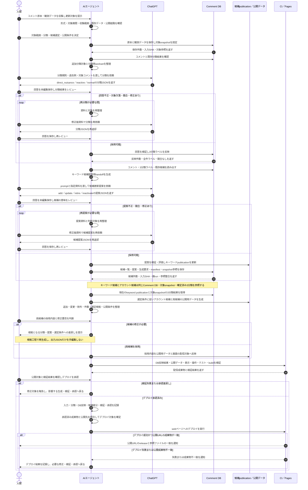

# シーケンス図: フィルターキーワード候補・ブロックアカウント候補の更新からwebページへのデプロイまで

対象の作業タスク列は [WORK_TASK_SEQUENCE.md](./WORK_TASK_SEQUENCE.md) を参照する。

```mermaid
sequenceDiagram
    autonumber
    actor Human as 人間
    participant Agent as AIエージェント
    participant ChatGPT as ChatGPT
    participant DB as Comment DB
    participant Publication as 候補publication／公開データ
    participant CI as CI／Pages

    Human->>Agent: コメント原本・観測データを収集し更新対象を提示
    Agent->>Agent: 形式・対象期間・収集範囲・既存データ・公開経路を確認
    Human->>Agent: 対象範囲・分類・候補選定・公開条件を決定
    Agent->>DB: 原本と観測データを保存し対象snapshotを固定
    DB-->>Agent: 保存件数・入力SHA・対象参照を返す

    Agent->>DB: コメントと既存分類結果を確認
    Agent->>Agent: 追加分類対象と分類用worksetを整理
    Human->>ChatGPT: 分類規則・過去例・対象コメントを渡して分類を依頼
    ChatGPT-->>Human: direct_nuisance／reactive／normalの分類JSONを返す
    Human->>Agent: 回答を未編集保存し分類結果をレビュー
    alt 回答不正・対象欠落・競合・修正あり
        loop 再分類が必要な間
            Agent->>Agent: 資料と対象を再整理
            Human->>ChatGPT: 修正版資料で分類を再依頼
            ChatGPT-->>Human: 分類JSONを再返却
            Human->>Agent: 回答を保存し再レビュー
        end
    else 採用可能
        Agent->>DB: 回答を検証し3分類ラベルを反映
        DB-->>Agent: 反映件数・全件ラベル・競合なしを返す
    end

    Agent->>DB: コメント・3分類ラベル・既存候補を読み出す
    Agent->>Agent: キーワード候補提案用handoffを生成
    Human->>ChatGPT: promptと指定資料を渡して候補更新提案を依頼
    ChatGPT-->>Human: add／update／retire／reactivateの提案JSONを返す
    Human->>Agent: 回答を未編集保存し候補の意味をレビュー
    alt 提案不正・競合・修正あり
        loop 再提案が必要な間
            Agent->>Agent: 提案資料と判断対象を再整理
            Human->>ChatGPT: 修正版資料で候補提案を再依頼
            ChatGPT-->>Human: 候補提案JSONを再返却
            Human->>Agent: 回答を保存し再レビュー
        end
    else 採用可能
        Agent->>Publication: 提案を検証・評価しキーワードpublicationを更新
        Agent->>DB: 候補一覧・提案・生成要求・manifest・snapshot参照を保存
        DB-->>Agent: 候補件数・入力SHA・親run・参照整合を返す
    end

    Note over Agent,DB: キーワード候補とアカウント候補は同じComment DB・対象snapshot・確定済み3分類を参照する
    Agent->>DB: 現在のkeyword publicationと対象snapshotの3分類結果を取得
    Agent->>Publication: 選定条件に従いアカウント候補と両候補の公開用データを生成
    Agent->>Agent: 追加・変更・除外・件数・選定根拠・公開条件を整理
    Human->>Agent: 両候補の採用内容と修正要否を判断
    alt 候補の修正が必要
        Agent-->>Human: 根拠となる分類・提案・選定条件への差戻しを提示
        Note over Human,Agent: 根拠工程で再生成し、出力JSONだけを手編集しない
    else 両候補を採用
        Agent->>Publication: 採用内容を公開用データと画面の配信対象へ反映
    end

    Agent->>CI: DB反映結果・公開データ・表示・操作・テスト・buildを検証
    CI-->>Agent: 配信成果物と検証結果を返す
    Human->>Agent: 公開対象と検証結果を確認しデプロイを承認
    alt 検証失敗または承認差戻し
        Agent-->>Human: 修正対象を報告し、影響する生成・検証・承認へ戻る
    else デプロイ承認済み
        Agent->>Agent: 入力・分類・DB反映・候補差分・検証・承認を記録
        Agent->>Agent: 承認済み成果物と公開先を照合してデプロイ対象を確定
        Agent->>CI: webページへのデプロイを実行
        alt デプロイ成功かつ公開URLの成果物が一致
            CI-->>Human: 公開URLのreleaseと参照ファイルの一致を通知
        else デプロイ失敗または公開成果物不一致
            CI-->>Agent: 失敗または成果物不一致を通知
            Agent-->>Human: デプロイ結果を記録し、必要な修正・検証・承認へ戻る
        end
    end
```
